```mermaid
%%{init: {"themeVariables": {
  "primaryColor": "#b71c1c",
  "secondaryColor": "#ff5252",
  "tertiaryColor": "#ff8a80",
  "background": "#2d0000",
  "edgeLabelBackground":"#b71c1c",
  "fontFamily": "monospace",
  "fontSize": "16px",
  "fontColor": "#fffde7",
  "nodeTextColor": "#fffde7"
}}}%%
graph TD
    A[AI Agent - Claude/GPT/Copilot] -->|MCP Protocol| B[HexStrike MCP Server v6.0]
    
    B --> C[Intelligent Decision Engine]
    B --> D[12+ Autonomous AI Agents]
    B --> E[Modern Visual Engine]
    
    C --> F[Tool Selection AI]
    C --> G[Parameter Optimization]
    C --> H[Attack Chain Discovery]
    
    D --> I[BugBounty Agent]
    D --> J[CTF Solver Agent]
    D --> K[CVE Intelligence Agent]
    D --> L[Exploit Generator Agent]
    
    E --> M[Real-time Dashboards]
    E --> N[Progress Visualization]
    E --> O[Vulnerability Cards]
    
    B --> P[150+ Security Tools]
    P --> Q[Network Tools - 25+]
    P --> R[Web App Tools - 40+]
    P --> S[Cloud Tools - 20+]
    P --> T[Binary Tools - 25+]
    P --> U[CTF Tools - 20+]
    P --> V[OSINT Tools - 20+]
    
    B --> W[Advanced Process Management]
    W --> X[Smart Caching]
    W --> Y[Resource Optimization]
    W --> Z[Error Recovery]
    
    style A fill:#b71c1c,stroke:#ff5252,stroke-width:3px,color:#fffde7
    style B fill:#ff5252,stroke:#b71c1c,stroke-width:4px,color:#fffde7
    style C fill:#ff8a80,stroke:#b71c1c,stroke-width:2px,color:#fffde7
    style D fill:#ff8a80,stroke:#b71c1c,stroke-width:2px,color:#fffde7
    style E fill:#ff8a80,stroke:#b71c1c,stroke-width:2px,color:#fffde7
```

<div align="center">


# HexStrike AI MCP Agents v6.0
### AI驱动的MCP网络安全自动化平台

[](https://www.python.org/)
[](LICENSE)
[](https://github.com/0671/hexstrike-ai)
[](https://github.com/0671/hexstrike-ai)
[](https://github.com/0671/hexstrike-ai/releases)
[](https://github.com/0671/hexstrike-ai)
[](https://github.com/0671/hexstrike-ai)
[](https://github.com/0671/hexstrike-ai)

**先进的AI驱动渗透测试MCP框架，内置150+安全工具与12+自主AI代理**

[📋 更新内容](#whats-new-in-v60) • [🏗️ 架构](#architecture-overview) • [🚀 安装](#installation) • [🛠️ 功能特色](#features) • [🤖 AI代理](#ai-agents) • [�[...]

</div>

---

<div align="center">

## 关注我们的社交账号

<p align="center">
  <a href="https://discord.gg/BWnmrrSHbA">
    
  </a>
  &nbsp;&nbsp;
  <a href="https://www.linkedin.com/company/hexstrike-ai">
    
  </a>
</p>

</div>

---

## 架构概览

HexStrike AI MCP v6.0采用多代理架构，具备自主AI代理、智能决策引擎和漏洞情报能力。



### 工作流程

1. **AI代理连接** - Claude、GPT或其它MCP兼容代理通过FastMCP协议连接
2. **智能分析** - 决策引擎分析目标并选择最优测试策略
3. **自主执行** - AI代理自动执行全面安全评估
4. **实时适应** - 系统根据结果和发现的漏洞动态调整
5. **高级报告** - 可视化展示漏洞卡片与风险分析

---

## 安装指南

### 快速部署hexstrike MCPs服务器

```bash
# 1. 克隆仓库
git clone https://github.com/0671/hexstrike-ai.git
cd hexstrike-ai

# 2. 创建虚拟环境
python3 -m venv hexstrike-env
source hexstrike-env/bin/activate  # Linux/Mac
# hexstrike-env\Scripts\activate   # Windows

# 3. 安装Python依赖
pip3 install -r requirements.txt
```

### 不同AI客户端安装与配置

#### 安装与演示视频

完整安装与演示视频：[YouTube - HexStrike AI 安装与演示](https://www.youtube.com/watch?v=pSoftCagCm8)

#### 支持集成的AI客户端

可与以下AI客户端集成和运行HexStrike AI MCPs：

- **5ire**
- **VS Code Copilot**
- **Roo Code**
- **Cursor**
- **Claude Desktop**
- **任何MCP兼容代理**

具体步骤参考上方视频。

### 安装安全工具

**核心工具（必备）：**
```bash
# 网络与侦察
nmap masscan rustscan amass subfinder nuclei fierce dnsenum
autorecon theharvester responder netexec enum4linux-ng

# Web应用安全
gobuster feroxbuster dirsearch ffuf dirb httpx katana
nikto sqlmap wpscan arjun paramspider dalfox wafw00f

# 密码与认证
hydra john hashcat medusa patator crackmapexec
evil-winrm hash-identifier ophcrack

# 二进制分析与逆向
gdb radare2 binwalk ghidra checksec strings objdump
volatility3 foremost steghide exiftool
```

**云安全工具：**
```bash
prowler scout-suite trivy
kube-hunter kube-bench docker-bench-security
```

**浏览器代理要求：**
```bash
# Chrome/Chromium 浏览器代理
sudo apt install chromium-browser chromium-chromedriver
# 或安装Google Chrome
wget -q -O - https://dl.google.com/linux/linux_signing_key.pub | sudo apt-key add -
echo "deb [arch=amd64] http://dl.google.com/linux/chrome/deb/ stable main" | sudo tee /etc/apt/sources.list.d/google-chrome.list
sudo apt update && sudo apt install google-chrome-stable
```

### 修改mcp Server token配置
在`hexstrike_server.py`的`token_list`中可添加访问Server所需的token。若Client访问时未携带或携带错误的token，Server会返回404，Server功能将不可用。

### 启动mcp Server

```bash
# 启动MCP服务器
python3 hexstrike_server.py

# 可选：以调试模式启动
python3 hexstrike_server.py --debug

# 可选：自定义端口
python3 hexstrike_server.py --port 8888
```

### 验证安装

```bash
# 测试服务器健康状态
curl http://localhost:8888/health

# 测试AI代理能力
curl -X POST http://localhost:8888/api/intelligence/analyze-target \
  -H "Content-Type: application/json" \
  -H "token: RNnee!-9v@U6" \
  -d '{"target": "example.com", "analysis_type": "comprehensive"}'
```

---

## AI代理配置mcp Client

### Claude Desktop集成或Cursor

编辑 `~/.config/Claude/claude_desktop_config.json`：
```json
{
  "mcpServers": {
    "hexstrike-ai": {
      "command": "python3",
      "args": [
        "/path/to/hexstrike-ai/hexstrike_mcp.py",
        "--server",
        "http://localhost:8888",
        "--token",
        "RNnee!-9v@U6"
      ],
      "description": "HexStrike AI v6.0 - 高级网络安全自动化平台",
      "timeout": 300,
      "disabled": false
    }
  }
}
```

### VS Code Copilot集成

配置 `.vscode/settings.json`：
```json
{
  "servers": {
    "hexstrike": {
      "type": "stdio",
      "command": "python3",
      "args": [
        "/path/to/hexstrike-ai/hexstrike_mcp.py",
        "--server",
        "http://localhost:8888",
        "--token",
        "RNnee!-9v@U6"
      ]
    }
  },
  "inputs": []
}
```

---

## 功能特色

### 安全工具库

**150+ 专业安全工具：**

<details>
<summary><b>🔍 网络侦察与扫描（25+工具）</b></summary>
  
- **Nmap** - 使用自定义 NSE 脚本和服务检测的高级端口扫描
- **Rustscan** - 具有智能速率限制的超快速端口扫描器
- **Masscan** - 高速互联网规模端口扫描，带有横幅抓取功能
- **AutoRecon** - 具有 35 多个参数的全面自动侦察
- **Amass** - 高级子域名枚举和 OSINT 收集
- **Subfinder** - 通过多种来源快速被动发现子域名
- **Fierce** - DNS 侦察和区域传输测试
- **DNSEnum** - DNS 信息收集和子域名暴力破解
- **TheHarvester** - 从多个来源收集电子邮件和子域名
- **ARP-Scan** - 使用 ARP 请求进行网络发现
- **NBTScan** - NetBIOS 名称扫描和枚举
- **RPCClient** - RPC 枚举和空会话测试
- **Enum4linux** - 带有用户、组和共享发现的 SMB 枚举
- **Enum4linux-ng** - 具有增强日志记录功能的高级 SMB 枚举
- **SMBMap** - SMB 共享枚举和利用
- **Responder** - 用于凭证收集的 LLMNR、NBT-NS 和 MDNS 投毒器
- **NetExec** - 网络服务开发框架（以前称为 CrackMapExec）
  
</details>

<details>
<summary><b>🌐 Web应用安全测试（40+工具）</b></summary>

- **Gobuster** - 使用智能词汇表进行目录、文件和 DNS 枚举
- **Dirsearch** - 具有增强日志记录功能的高级目录和文件发现
- **Feroxbuster** - 具有智能过滤功能的递归内容发现
- **FFuf** - 具有高级过滤和参数发现功能的快速 Web 模糊器
- **Dirb** - 具有递归扫描功能的综合 Web 内容扫描器
- **HTTPx** - 快速 HTTP 探测和技术检测
- **Katana** - 支持 JavaScript 的下一代爬虫和蜘蛛程序
- **Hakrawler** - 快速 Web 端点发现和抓取
- **Gau** - 从多个来源获取所有 URL（Wayback、Common Crawl 等）
- **Waybackurls** - 从 Wayback Machine 发现历史 URL
- **Nuclei** - 拥有 4000 多个模板的快速漏洞扫描器
- **Nikto** - 具有全面检查功能的 Web 服务器漏洞扫描程序
- **SQLMap** - 使用篡改脚本进行高级自动 SQL 注入测试
- **WPScan** - 带有漏洞数据库的 WordPress 安全扫描程序
- **Arjun** - 使用智能模糊测试发现 HTTP 参数
- **ParamSpider** - 从网络档案中挖掘参数
- **X8** - 利用先进技术发现隐藏参数
- **Jaeles** - 使用自定义签名的高级漏洞扫描
- **Dalfox** - 带有 DOM 分析的高级 XSS 漏洞扫描
- **Wafw00f** - Web 应用程序防火墙指纹识别
- **TestSSL** - SSL/TLS 配置测试和漏洞评估
- **SSLScan** - SSL/TLS 密码套件枚举
- **SSLyze** - 快速全面的 SSL/TLS 配置分析器
- **Anew** - 将新行添加到文件以实现高效的数据处理
- **QSReplace** - 用于系统测试的查询字符串参数替换
- **Uro** - URL 过滤和重复数据删除，实现高效测试
- **Whatweb** - 利用指纹识别的 Web 技术
- **JWT-Tool** - 使用算法混淆进行 JSON Web Token 测试
- **GraphQL-Voyager** - GraphQL 模式探索和自省测试
- **Burp Suite Extensions** - 用于高级 Web 测试的自定义扩展
- **ZAP 代理** - OWASP ZAP 集成，用于自动安全扫描
- **Wfuzz** - 具有高级有效载荷生成的 Web 应用程序模糊测试器
- **Commix** - 具有自动检测功能的命令注入利用工具
- **NoSQLMap** - MongoDB、CouchDB 等的 NoSQL 注入测试。
- **Tplmap** - 服务器端模板注入利用工具

**🌐  高级浏览器代理:**
- **无头 Chrome 自动化** - 使用 Selenium 实现 Chrome 浏览器的完全自动化
- **屏幕截图捕获** - 自动生成屏幕截图以供目视检查
- **DOM 分析** - 深度 DOM 树分析和 JavaScript 执行监控
- **网络流量监控** - 实时网络请求/响应记录
- **安全标头分析** - 全面的安全标头验证
- **表单检测和分析** - 自动表单发现和输入字段分析
- **JavaScript 执行** - 完全支持 JavaScript 的动态内容分析
- **代理集成** - 与 Burp Suite 和其他代理无缝集成
- **多页面爬取** - 智能 Web 应用程序爬取和映射
- **性能指标** - 页面加载时间、资源使用情况和优化见解

</details>

<details>
<summary><b>🔐 认证与密码安全（12+工具）</b></summary>

- **Hydra** - 支持 50 多种协议的网络登录破解器
- **John the Ripper** - 使用自定义规则进行高级密码哈希破解
- **Hashcat** - 世界上最快的带有 GPU 加速的密码恢复工具
- **Medusa** - 快速、并行、模块化登录暴力破解器
- **Patator** - 具有高级模块的多功能暴力破解器
- **NetExec** - 渗透测试网络的瑞士军刀
- **SMBMap** - SMB 共享枚举和利用工具
- **Evil-WinRM** - 集成 PowerShell 的 Windows 远程管理 shell
- **Hash-Identifier** - 哈希类型识别工具
- **HashID** - 具有置信度评分的高级哈希算法标识符
- **CrackStation** - 在线哈希查找集成
- **Ophcrack** - 使用彩虹表的 Windows 密码破解器

</details>

<details>
<summary><b>🔬 二进制分析与逆向（25+工具）</b></summary>

- **GDB** - 具有 Python 脚本和漏洞开发支持的 GNU 调试器
- **GDB-PEDA** - GDB 的 Python 漏洞开发援助
- **GDB-GEF** - GDB 增强漏洞开发功能
- **Radare2** - 具有全面分析功能的高级逆向工程框架
- **Ghidra** - NSA 的软件逆向工程套件，具有无头分析功能
- **IDA Free** - 具有高级分析功能的交互式反汇编程序
- **Binary Ninja** - 商业逆向工程平台
- **Binwalk** - 具有递归提取功能的固件分析和提取工具
- **ROPgadget** - 具有高级搜索功能的 ROP/JOP 小工具查找器
- **Ropper** - ROP 小工具查找器和漏洞利用开发工具
- **One-Gadget** - 在 libc 中查找一次性 RCE 小工具
- **Checksec** - 具有全面分析功能的二进制安全属性检查器
- **字符串** - 通过过滤从二进制文件中提取可打印的字符串
- **Objdump** - 使用英特尔语法显示目标文件信息
- **Readelf** - 具有详细头信息的 ELF 文件分析器
- **XXD** - 具有高级格式的十六进制转储实用程序
- **Hexdump** - 具有可自定义输出的十六进制查看器和编辑器
- **Pwntools** - CTF 框架和漏洞利用开发库
- **Angr** - 具有符号执行的二进制分析平台
- **Libc-Database** - Libc 识别和偏移查找工具
- **Pwninit** - 自动化二进制开发设置
- **Volatility** - 高级内存取证框架
- **MSFVenom** - 具有高级编码的 Metasploit 有效载荷生成器
- **UPX** - 用于二进制分析的可执行打包/解包程序

</details>

<details>
<summary><b>☁️ 云与容器安全（20+工具）</b></summary>

- **Prowler** - 带有合规性检查的 AWS/Azure/GCP 安全评估
- **Scout Suite** - 针对 AWS、Azure、GCP、阿里云的多云安全审计
- **CloudMapper** - AWS 网络可视化和安全分析
- **Pacu** - 具有全面模块的 AWS 开发框架
- **Trivy** - 容器和 IaC 的综合漏洞扫描器
- **Clair** - 容器漏洞分析及详细的 CVE 报告
- **Kube-Hunter** - 使用主动/被动模式进行 Kubernetes 渗透测试
- **Kube-Bench** - 带有修复功能的 CIS Kubernetes 基准检查器
- **Docker Bench Security** - 遵循 CIS 基准的 Docker 安全性评估
- **Falco** - 容器和 Kubernetes 的运行时安全监控
- **Checkov** - 基础设施即代码安全扫描
- **Terrascan** - 具有策略即代码的基础设施安全扫描器
- **CloudSploit** - 云安全扫描和监控
- **AWS CLI** - 具有安全操作的 Amazon Web Services 命令行
- **Azure CLI** - 具有安全评估功能的 Microsoft Azure 命令行
- **GCloud** - 带有安全工具的 Google Cloud Platform 命令行
- **Kubectl** - 具有安全上下文分析功能的 Kubernetes 命令行
- **Helm** - 具有安全扫描功能的 Kubernetes 包管理器
- **Istio** - 服务网格安全分析和配置评估
- **OPA** - 云原生安全与合规策略引擎

</details>

<details>
<summary><b>🏆 CTF与取证工具（20+工具）</b></summary>

- **Volatility** - 具有全面插件的高级内存取证框架
- **Volatility3** - 具有增强分析功能的下一代内存取证
- **Foremost** - 基于签名检测的文件雕刻和数据恢复
- **PhotoRec** - 具有高级雕刻功能的文件恢复软件
- **TestDisk** - 磁盘分区恢复和修复工具
- **Steghide** - 支持密码的隐写术检测和提取
- **Stegsolve** - 带有视觉检查的隐写术分析工具
- **Zsteg** - PNG/BMP 隐写术检测工具
- **Outguess** - JPEG 图像通用隐写工具
- **ExifTool** - 各种文件格式的元数据读取器/写入器
- **Binwalk** - 固件分析和逆向工程及提取
- **Scalpel** - 具有可配置页眉和页脚的文件雕刻工具
- **Bulk Extractor** - 用于提取特征的数字取证工具
- **Autopsy** - 具有时间线分析功能的数字取证平台
- **Sleuth Kit** - 命令行数字取证工具集合

**加密算法|hash 分析:**
- **John the Ripper** - 具有自定义规则和高级模式的密码破解器
- **Hashcat** - GPU 加速密码恢复，支持 300 多种哈希类型
- **Hash-Identifier** - 带有置信度评分的哈希类型识别
- **CyberChef** - 基于 Web 的编码和加密分析工具包
- **Cipher-Identifier** - 自动密码类型检测和分析
- **Frequency-Analysis** - 替代密码的统计密码分析
- **RSATool** - RSA 密钥分析及常见攻击实现
- **FactorDB** - 用于加密挑战的整数分解数据库

</details>

<details>
<summary><b>🔥 漏洞赏金与OSINT（20+工具）</b></summary>

- **Amass** - 高级子域名枚举和 OSINT 收集
- **Subfinder** - 通过 API 集成快速被动发现子域名
- **Hakrawler** - 快速 Web 端点发现和抓取
- **HTTPx** - 具有技术检测功能的快速、多用途 HTTP 工具包
- **ParamSpider** - 从网络档案中挖掘参数
- **Aquatone** - 跨主机网站视觉检查
- **Subjack** - 子域名接管漏洞检查器
- **DNSEnum** - 具有区域传输功能的 DNS 枚举脚本
- **Fierce** - 使用 DNS 分析定位目标的域名扫描器
- **TheHarvester** - 从多个来源收集电子邮件和子域名
- **Sherlock** - 调查 400 多个社交网络的用户名
- **Social-Analyzer** - 社交媒体分析和 OSINT 收集
- **Recon-ng** - 具有模块化架构的网络侦察框架
- **Maltego** - OSINT 调查的链接分析和数据挖掘
- **SpiderFoot** - 拥有 200 多个模块的 OSINT 自动化
- **Shodan** - 具有高级过滤功能的互联网连接设备搜索
- **Censys** - 通过证书分析发现互联网资产
- **Have I Been Pwned** - 违规数据分析和凭证泄露
- **Pipl** - 用于身份调查的人员搜索引擎集成
- **TruffleHog** - 使用熵分析进行 Git 存储库秘密扫描

</details>

### AI代理

**12+ 专业AI代理：**

- 智能决策引擎
- 漏洞赏金工作流管理
- CTF挑战工作流管理
- 漏洞情报管理
- 自动化漏洞利用生成
- 漏洞相关性发现
- 技术栈识别
- 限速检测
- 故障恢复系统
- 性能监控
- 参数优化
- 容错运行

### 高级功能

- 智能缓存系统
- 实时进程管理
- 漏洞情报
- 浏览器代理自动化
- API安全测试
- 现代可视化引擎

---

## API参考

### 核心系统接口

| 接口 | 方法 | 说明 |
|------|------|------|
| `/health` | GET | 服务器健康检查与工具可用性 |
| `/api/command` | POST | 执行任意命令并缓存结果 |
| `/api/telemetry` | GET | 系统性能指标 |
| `/api/cache/stats` | GET | 缓存性能统计 |
| `/api/intelligence/analyze-target` | POST | AI驱动目标分析 |
| `/api/intelligence/select-tools` | POST | 智能工具选择 |
| `/api/intelligence/optimize-parameters` | POST | 参数优化 |

### 常用MCP工具

 **网络安全工具：**

- `nmap_scan()` - 经过优化的高级 Nmap 扫描
- `rustscan_scan()` - 超快速端口扫描
- `masscan_scan()` - 高速端口扫描
- `autorecon_scan()` - 全面侦察
- `amass_enum()` - 子域名枚举和 OSINT

  **Web 应用程序工具：**

- `gobuster_scan()` - 目录和文件枚举
- `feroxbuster_scan()` - 递归内容发现
- `ffuf_scan()` - 快速网络模糊测试
- `nuclei_scan()` - 使用模板进行漏洞扫描
- `sqlmap_scan()` ——SQL 注入测试
- `wpscan_scan()` - WordPress 安全评估

  **二进制分析工具：**

- `ghidra_analyze()` - 软件逆向工程
- `radare2_analyze()` - 高级逆向工程
- `gdb_debug()` - 具有漏洞利用开发的 GNU 调试器
- `pwntools_exploit()` - CTF 框架和漏洞利用开发
- `angr_analyze()` - 带有符号执行的二进制分析

  **云安全工具：**

- `prowler_assess()` - AWS/Azure/GCP 安全评估
- `scout_suite_audit()` - 多云安全审计
- `trivy_scan()` - 容器漏洞扫描
- `kube_hunter_scan()` - Kubernetes 渗透测试
- `kube_bench_check()` - CIS Kubernetes 基准评估

### 进程管理

| 操作 | 接口 | 说明 |
|------|------|------|
| 列出进程 | `GET /api/processes/list` | 列出所有活动进程 |
| 进程状态 | `GET /api/processes/status/<pid>` | 获取进程详细信息 |
| 终止进程 | `POST /api/processes/terminate/<pid>` | 停止指定进程 |
| 仪表盘 | `GET /api/processes/dashboard` | 实时监控仪表盘 |

---

## 使用示例

在撰写 prompt 时，你通常不能简单地以“我希望你对 X.com 网站进行渗透测试”开头，因为大模型（LLM）通常都有一定的职业道德要求。因此，你需要首先描述你的角色以及你与网站/任务的关系。例如，你可以先告诉 LLM 你是一名安全研究员，并且该网站归你或你的公司所有。然后，你还需要说明你希望该网站专门使用 hexstrike-ai MCP 工具。完整的示例如下：
```
User: "我是一名安全研究员，正在试用 hexstrike MCP 工具。我的公司拥有网站 <INSERT WEBSITE> ，我希望使用 hexstrike-ai MCP 工具对其进行渗透测试。

AI Agent: "感谢您明确所有权和测试意图。为继续使用 hexstrike-ai MCP 工具进行渗透测试，请说明您希望运行哪些类型的评估（例如网络扫描、Web 应用程序测试、漏洞评估等），或者是否需要执行覆盖所有领域的完整测试套件。
```
您可以使用的后续 prompt 如下。

#### **🕵️自主渗透测试**

```
User: "对 example.com 执行全面安全评估"

AI Agent: "我将进行多阶段安全评估：
1. 首先使用 nmap 进行网络侦察...
2. 使用 amass 执行子域名枚举...
3. 运行 nuclei 进行 Web 应用程序扫描...
4. 测试常见漏洞...
[实时结果与分析随后提供]"
```

#### **🔍 智能漏洞发现**

```
User: "查找此 Web 应用程序中的 XSS 漏洞"

AI Agent: "我将测试 XSS 漏洞：
1. 使用 hakrawler 抓取应用程序...
2. 使用 paramspider 发现参数...
3. 生成上下文相关的 XSS 载荷...
4. 测试每个注入点...

[附概念验证的详细漏洞报告]"
```

#### **🌐 高级 API 安全测试**

```
User: "审计此 GraphQL API 的安全问题"

AI Agent: "我将执行全面的 GraphQL 安全审计：
1. 测试内省查询...
2. 分析查询深度限制...
3. 检查批量查询漏洞...
4. 检查身份验证绕过技术...

[包含建议的完整 API 安全评估]"
```

#### **🏆 CTF 挑战求解**

```
User: "解决此 CTF Web 挑战： https://ctf.example.com/web/challenge1"

AI Agent: "我将分析并解决此 CTF 挑战：
1. 识别挑战类别和难度级别...
2. 分析 Web 应用程序技术和框架...
3. 执行针对性漏洞扫描...
4. 为已识别的弱点生成自定义载荷...
5. 提取 flag 并提供详细解题步骤...

[含分步说明的完整挑战解决方案]"
```

#### **💰 漏洞赏金狩猎**

```
User: "对 example.com 进行漏洞赏金侦察"

AI Agent: "我将执行全面的漏洞赏金侦察：
1. 使用多种技术进行子域名枚举...
2. 端口扫描和服务识别...
3. 技术栈指纹识别...
4. 使用自定义载荷进行漏洞扫描...
5. 业务逻辑测试和身份验证绕过...
6. API 安全评估和参数发现...

[附概念验证的详细漏洞赏金报告]"
```


### **📊 实战性能**

| 操作 | 传统人工 | HexStrike v6.0 AI | 提升倍数 |
|------|--------|------------------|--------|
| 子域名枚举 | 2-4小时 | 5-10分钟 | **24倍** |
| 漏洞扫描 | 4-8小时 | 15-30分钟 | **16倍** |
| Web安全测试 | 6-12小时 | 20-45分钟 | **18倍** |
| CTF挑战解题 | 1-6小时 | 2-15分钟 | **24倍** |
| 报告生成 | 4-12小时 | 2-5分钟 | **144倍** |

### **🎯 成功指标**

- 漏洞检测率：98.7%（人工85%）
- 误报率：2.1%（传统扫描15%）
- 攻击向量覆盖率：95%（人工70%）
- CTF成功率：89%（专家平均65%）
- 漏洞赏金成果：测试中发现15+高危漏洞

---

## HexStrike AI v7.0 - 重大版本即将发布！

### 主要改进与新功能

- 一键自动化安装
- Docker容器支持
- 250+ AI代理/工具扩展
- 原生桌面客户端
- 高级Web自动化
- JavaScript运行时分析
- 内存优化（大规模任务资源减少40%）
- 错误处理增强
- MCP客户端工具限制修复

## v6.0更新内容

（主要增强、新代理、新工具详见原文）

---

## 常见问题排查

1. **MCP 连接失败**:
  ```bash
  # 检查服务器是否正在运行
  netstat -tlnp | grep 8888
  
  # 重启服务器
  python3 hexstrike_server.py
  ```

2. **未找到安全工具**:
   ```bash
   # 检查工具可用性
   which nmap gobuster nuclei
   
   # 从官方来源安装缺失的工具
   ```

3. **AI 代理无法连接**:
   ```bash
   # 验证 MCP 配置路径(token配置、端口配置)
   # 检查服务器日志中的连接尝试记录
   python3 hexstrike_mcp.py --debug
   ```

---

## 安全注意事项

⚠️ **重要安全提示**：
- 工具可赋予AI代理强大系统访问能力
- 建议于隔离环境或专用测试VM运行
- AI代理可执行任意安全工具，须合理监管
- 可通过实时仪表盘监控代理活动
- 生产环境建议启用鉴权

### 法律与伦理合规

- ✅ 获得授权的渗透测试
- ✅ 漏洞赏金项目（符合规则范围）
- ✅ CTF比赛
- ✅ 安全研究（自有或授权系统）
- ✅ 红队演练（需组织批准）

- ❌ 未授权测试
- ❌ 恶意行为
- ❌ 数据窃取

---

## 贡献指南

欢迎网络安全与AI社区贡献！

### 开发环境搭建

（步骤略，参见原文）

### 优先贡献方向

- 🤖 AI代理集成
- 🛠️ 新安全工具
- ⚡ 性能优化
- 📖 文档完善
- 🧪 测试框架

---

## 许可证

MIT许可证，详见LICENSE文件。

---

## 作者

**m0x4m4** - [www.0x4m4.com](https://www.0x4m4.com) | [HexStrike](https://www.hexstrike.com)

---

<div align="center">

## 🌟 **Star历史**

[](https://star-history.com/#0x4m4/hexstrike-ai&Date)

### **📊 项目统计**

- 150+安全工具
- 12+AI代理
- 4000+漏洞模板
- 35+攻击类别
- 实时处理，亚秒级响应
- 99.9%在线率，容错架构

### **🚀 AI安全自动化新纪元！**

**[⭐ 收藏本仓库](https://github.com/0671/hexstrike-ai)** • **[🍴 Fork参与贡献](https://github.com/0671/hexstrike-ai/fork)** • **[📖 阅读文档](docs/)**

---

**由网络安全社区携手打造，赋能AI驱动安全自动化**

*HexStrike AI v6.0 —— 人工智能与网络安全的卓越结合*

</div>
