```mermaid
%%{init: {"themeVariables": {
  "primaryColor": "#b71c1c",
  "secondaryColor": "#ff5252",
  "tertiaryColor": "#ff8a80",
  "background": "#2d0000",
  "edgeLabelBackground":"#b71c1c",
  "fontFamily": "monospace",
  "fontSize": "16px",
  "fontColor": "#fffde7",
  "nodeTextColor": "#fffde7"
}}}%%
graph TD
    A[AI Agent - Claude/GPT/Copilot] -->|MCP Protocol| B[HexStrike MCP Server v6.0]
    
    B --> C[Intelligent Decision Engine]
    B --> D[12+ Autonomous AI Agents]
    B --> E[Modern Visual Engine]
    
    C --> F[Tool Selection AI]
    C --> G[Parameter Optimization]
    C --> H[Attack Chain Discovery]
    
    D --> I[BugBounty Agent]
    D --> J[CTF Solver Agent]
    D --> K[CVE Intelligence Agent]
    D --> L[Exploit Generator Agent]
    
    E --> M[Real-time Dashboards]
    E --> N[Progress Visualization]
    E --> O[Vulnerability Cards]
    
    B --> P[150+ Security Tools]
    P --> Q[Network Tools - 25+]
    P --> R[Web App Tools - 40+]
    P --> S[Cloud Tools - 20+]
    P --> T[Binary Tools - 25+]
    P --> U[CTF Tools - 20+]
    P --> V[OSINT Tools - 20+]
    
    B --> W[Advanced Process Management]
    W --> X[Smart Caching]
    W --> Y[Resource Optimization]
    W --> Z[Error Recovery]
    
    style A fill:#b71c1c,stroke:#ff5252,stroke-width:3px,color:#fffde7
    style B fill:#ff5252,stroke:#b71c1c,stroke-width:4px,color:#fffde7
    style C fill:#ff8a80,stroke:#b71c1c,stroke-width:2px,color:#fffde7
    style D fill:#ff8a80,stroke:#b71c1c,stroke-width:2px,color:#fffde7
    style E fill:#ff8a80,stroke:#b71c1c,stroke-width:2px,color:#fffde7
```

<div align="center">


# HexStrike AI MCP Agents v6.0
### AI驱动的MCP网络安全自动化平台

[](https://www.python.org/)
[](LICENSE)
[](https://github.com/0671/hexstrike-ai)
[](https://github.com/0671/hexstrike-ai)
[](https://github.com/0671/hexstrike-ai/releases)
[](https://github.com/0671/hexstrike-ai)
[](https://github.com/0671/hexstrike-ai)
[](https://github.com/0671/hexstrike-ai)

**先进的AI驱动渗透测试MCP框架，内置150+安全工具与12+自主AI代理**

[📋 更新内容](#whats-new-in-v60) • [🏗️ 架构](#architecture-overview) • [🚀 安装](#installation) • [🛠️ 功能特色](#features) • [🤖 AI代理](#ai-agents) • [�[...]

</div>

---

<div align="center">

## 关注我们的社交账号

<p align="center">
  <a href="https://discord.gg/BWnmrrSHbA">
    
  </a>
  &nbsp;&nbsp;
  <a href="https://www.linkedin.com/company/hexstrike-ai">
    
  </a>
</p>

</div>

---

## 架构概览

HexStrike AI MCP v6.0采用多代理架构，具备自主AI代理、智能决策引擎和漏洞情报能力。



### 工作流程

1. **AI代理连接** - Claude、GPT或其它MCP兼容代理通过FastMCP协议连接
2. **智能分析** - 决策引擎分析目标并选择最优测试策略
3. **自主执行** - AI代理自动执行全面安全评估
4. **实时适应** - 系统根据结果和发现的漏洞动态调整
5. **高级报告** - 可视化展示漏洞卡片与风险分析

---

## 安装指南

### 快速部署hexstrike MCPs服务器

```bash
# 1. 克隆仓库
git clone https://github.com/0671/hexstrike-ai.git
cd hexstrike-ai

# 2. 创建虚拟环境
python3 -m venv hexstrike-env
source hexstrike-env/bin/activate  # Linux/Mac
# hexstrike-env\Scripts\activate   # Windows

# 3. 安装Python依赖
pip3 install -r requirements.txt
```

### 不同AI客户端安装与配置

#### 安装与演示视频

完整安装与演示视频：[YouTube - HexStrike AI 安装与演示](https://www.youtube.com/watch?v=pSoftCagCm8)

#### 支持集成的AI客户端

可与以下AI客户端集成和运行HexStrike AI MCPs：

- **5ire**
- **VS Code Copilot**
- **Roo Code**
- **Cursor**
- **Claude Desktop**
- **任何MCP兼容代理**

具体步骤参考上方视频。

### 安装安全工具

**核心工具（必备）：**
```bash
# 网络与侦察
nmap masscan rustscan amass subfinder nuclei fierce dnsenum
autorecon theharvester responder netexec enum4linux-ng

# Web应用安全
gobuster feroxbuster dirsearch ffuf dirb httpx katana
nikto sqlmap wpscan arjun paramspider dalfox wafw00f

# 密码与认证
hydra john hashcat medusa patator crackmapexec
evil-winrm hash-identifier ophcrack

# 二进制分析与逆向
gdb radare2 binwalk ghidra checksec strings objdump
volatility3 foremost steghide exiftool
```

**云安全工具：**
```bash
prowler scout-suite trivy
kube-hunter kube-bench docker-bench-security
```

**浏览器代理要求：**
```bash
# Chrome/Chromium 浏览器代理
sudo apt install chromium-browser chromium-chromedriver
# 或安装Google Chrome
wget -q -O - https://dl.google.com/linux/linux_signing_key.pub | sudo apt-key add -
echo "deb [arch=amd64] http://dl.google.com/linux/chrome/deb/ stable main" | sudo tee /etc/apt/sources.list.d/google-chrome.list
sudo apt update && sudo apt install google-chrome-stable
```

### 修改mcp Server token配置
在`hexstrike_server.py`的`token_list`中可添加访问Server所需的token。若Client访问时未携带或携带错误的token，Server会返回404，Server功能将不可用。

### 启动mcp Server

```bash
# 启动MCP服务器
python3 hexstrike_server.py

# 可选：以调试模式启动
python3 hexstrike_server.py --debug

# 可选：自定义端口
python3 hexstrike_server.py --port 8888
```

### 验证安装

```bash
# 测试服务器健康状态
curl http://localhost:8888/health

# 测试AI代理能力
curl -X POST http://localhost:8888/api/intelligence/analyze-target \
  -H "Content-Type: application/json" \
  -H "token: RNnee!-9v@U6" \
  -d '{"target": "example.com", "analysis_type": "comprehensive"}'
```

---

## AI代理配置mcp Client

### Claude Desktop集成或Cursor

编辑 `~/.config/Claude/claude_desktop_config.json`：
```json
{
  "mcpServers": {
    "hexstrike-ai": {
      "command": "python3",
      "args": [
        "/path/to/hexstrike-ai/hexstrike_mcp.py",
        "--server",
        "http://localhost:8888",
        "--token",
        "RNnee!-9v@U6"
      ],
      "description": "HexStrike AI v6.0 - 高级网络安全自动化平台",
      "timeout": 300,
      "disabled": false
    }
  }
}
```

### VS Code Copilot集成

配置 `.vscode/settings.json`：
```json
{
  "servers": {
    "hexstrike": {
      "type": "stdio",
      "command": "python3",
      "args": [
        "/path/to/hexstrike-ai/hexstrike_mcp.py",
        "--server",
        "http://localhost:8888",
        "--token",
        "RNnee!-9v@U6"
      ]
    }
  },
  "inputs": []
}
```

---

## 功能特色

### 安全工具库

**150+ 专业安全工具：**

<details>
<summary><b>🔍 网络侦察与扫描（25+工具）</b></summary>
（工具详细列表略，参见原文）
</details>

<details>
<summary><b>🌐 Web应用安全测试（40+工具）</b></summary>
（工具详细列表略，参见原文）
</details>

<details>
<summary><b>🔐 认证与密码安全（12+工具）</b></summary>
（工具详细列表略，参见原文）
</details>

<details>
<summary><b>🔬 二进制分析与逆向（25+工具）</b></summary>
（工具详细列表略，参见原文）
</details>

<details>
<summary><b>☁️ 云与容器安全（20+工具）</b></summary>
（工具详细列表略，参见原文）
</details>

<details>
<summary><b>🏆 CTF与取证工具（20+工具）</b></summary>
（工具详细列表略，参见原文）
</details>

<details>
<summary><b>🔥 漏洞赏金与OSINT（20+工具）</b></summary>
（工具详细列表略，参见原文）
</details>

### AI代理

**12+ 专业AI代理：**

- 智能决策引擎
- 漏洞赏金工作流管理
- CTF挑战工作流管理
- 漏洞情报管理
- 自动化漏洞利用生成
- 漏洞相关性发现
- 技术栈识别
- 限速检测
- 故障恢复系统
- 性能监控
- 参数优化
- 容错运行

### 高级功能

- 智能缓存系统
- 实时进程管理
- 漏洞情报
- 浏览器代理自动化
- API安全测试
- 现代可视化引擎

---

## API参考

### 核心系统接口

| 接口 | 方法 | 说明 |
|------|------|------|
| `/health` | GET | 服务器健康检查与工具可用性 |
| `/api/command` | POST | 执行任意命令并缓存结果 |
| `/api/telemetry` | GET | 系统性能指标 |
| `/api/cache/stats` | GET | 缓存性能统计 |
| `/api/intelligence/analyze-target` | POST | AI驱动目标分析 |
| `/api/intelligence/select-tools` | POST | 智能工具选择 |
| `/api/intelligence/optimize-parameters` | POST | 参数优化 |

### 常用MCP工具

（工具函数列表略，参见原文）

### 进程管理

| 操作 | 接口 | 说明 |
|------|------|------|
| 列出进程 | `GET /api/processes/list` | 列出所有活动进程 |
| 进程状态 | `GET /api/processes/status/<pid>` | 获取进程详细信息 |
| 终止进程 | `POST /api/processes/terminate/<pid>` | 停止指定进程 |
| 仪表盘 | `GET /api/processes/dashboard` | 实时监控仪表盘 |

---

## 使用示例

渗透测试、漏洞发现、API安全测试、CTF挑战、漏洞赏金等示例对话（内容略，参见原文）。

### **📊 实战性能**

| 操作 | 传统人工 | HexStrike v6.0 AI | 提升倍数 |
|------|--------|------------------|--------|
| 子域名枚举 | 2-4小时 | 5-10分钟 | **24倍** |
| 漏洞扫描 | 4-8小时 | 15-30分钟 | **16倍** |
| Web安全测试 | 6-12小时 | 20-45分钟 | **18倍** |
| CTF挑战解题 | 1-6小时 | 2-15分钟 | **24倍** |
| 报告生成 | 4-12小时 | 2-5分钟 | **144倍** |

### **🎯 成功指标**

- 漏洞检测率：98.7%（人工85%）
- 误报率：2.1%（传统扫描15%）
- 攻击向量覆盖率：95%（人工70%）
- CTF成功率：89%（专家平均65%）
- 漏洞赏金成果：测试中发现15+高危漏洞

---

## HexStrike AI v7.0 - 重大版本即将发布！

### 主要改进与新功能

- 一键自动化安装
- Docker容器支持
- 250+ AI代理/工具扩展
- 原生桌面客户端
- 高级Web自动化
- JavaScript运行时分析
- 内存优化（大规模任务资源减少40%）
- 错误处理增强
- MCP客户端工具限制修复

## v6.0更新内容

（主要增强、新代理、新工具详见原文）

---

## 常见问题排查

1. MCP连接失败
2. 安全工具找不到
3. AI代理无法连接
4. 启用调试模式获得详细日志

---

## 安全注意事项

⚠️ **重要安全提示**：
- 工具可赋予AI代理强大系统访问能力
- 建议于隔离环境或专用测试VM运行
- AI代理可执行任意安全工具，须合理监管
- 可通过实时仪表盘监控代理活动
- 生产环境建议启用鉴权

### 法律与伦理合规

- ✅ 获得授权的渗透测试
- ✅ 漏洞赏金项目（符合规则范围）
- ✅ CTF比赛
- ✅ 安全研究（自有或授权系统）
- ✅ 红队演练（需组织批准）

- ❌ 未授权测试
- ❌ 恶意行为
- ❌ 数据窃取

---

## 贡献指南

欢迎网络安全与AI社区贡献！

### 开发环境搭建

（步骤略，参见原文）

### 优先贡献方向

- 🤖 AI代理集成
- 🛠️ 新安全工具
- ⚡ 性能优化
- 📖 文档完善
- 🧪 测试框架

---

## 许可证

MIT许可证，详见LICENSE文件。

---

## 作者

**m0x4m4** - [www.0x4m4.com](https://www.0x4m4.com) | [HexStrike](https://www.hexstrike.com)

---

<div align="center">

## 🌟 **Star历史**

[](https://star-history.com/#0x4m4/hexstrike-ai&Date)

### **📊 项目统计**

- 150+安全工具
- 12+AI代理
- 4000+漏洞模板
- 35+攻击类别
- 实时处理，亚秒级响应
- 99.9%在线率，容错架构

### **🚀 AI安全自动化新纪元！**

**[⭐ 收藏本仓库](https://github.com/0671/hexstrike-ai)** • **[🍴 Fork参与贡献](https://github.com/0671/hexstrike-ai/fork)** • **[📖 阅读文档](docs/)**

---

**由网络安全社区携手打造，赋能AI驱动安全自动化**

*HexStrike AI v6.0 —— 人工智能与网络安全的卓越结合*

</div>